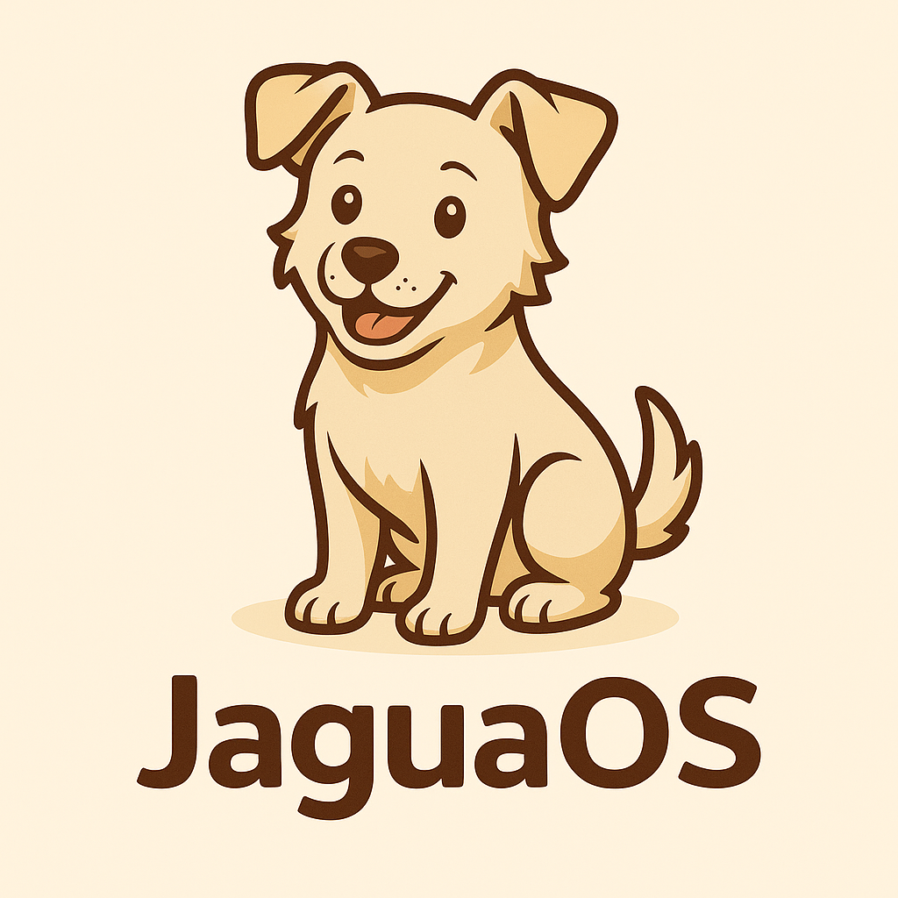

  

# JaguaOs
Sistema operativo liviano y educativo creado en Paraguay por Pacto Chandi.
# JaguaOS 🐶💻

**JaguaOS** es un sistema operativo ultra liviano (16MB), educativo y 100% paraguayo.  
Creado por **Pacto Chandi**, inspirado por la curiosidad y la libertad.

## 📚 JaguaOS Edu – Lecciones

🟢 [Descargar Lección 1: ¿Qué es un sistema operativo?](JaguaOS_Edu_Leccion_1.pdf)

## ¿Qué lo hace especial?

- Corre en cualquier compu vieja
- Hecho con Tiny Core Linux
- Viene con mensajes, retos y pistas para despertar cerebros

> No es solo tecnología. Es actitud.

## Autor

🐾 Pacto Chandi – Paraguay  
💬 #GPTesLOCO // #ÑandutíDigital
“Primer commit: README cargado”
